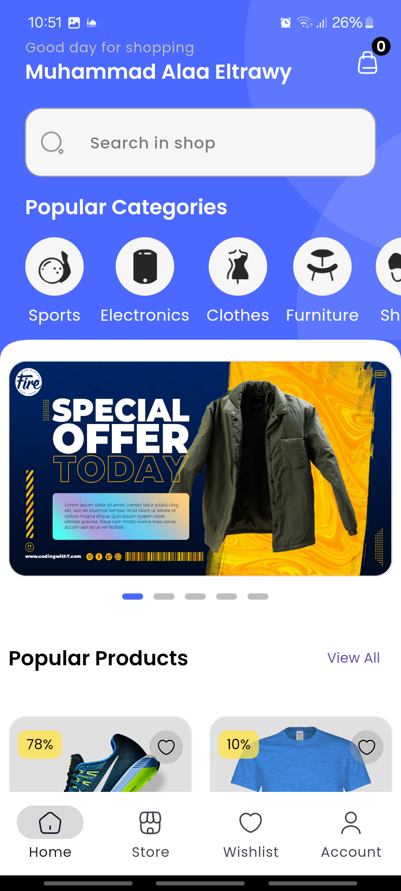
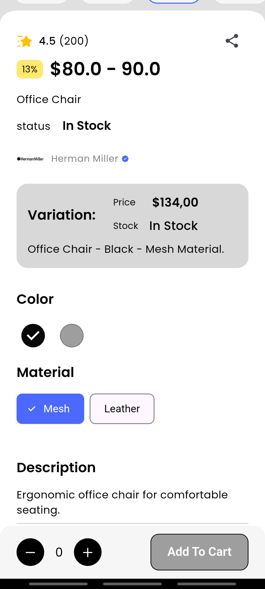
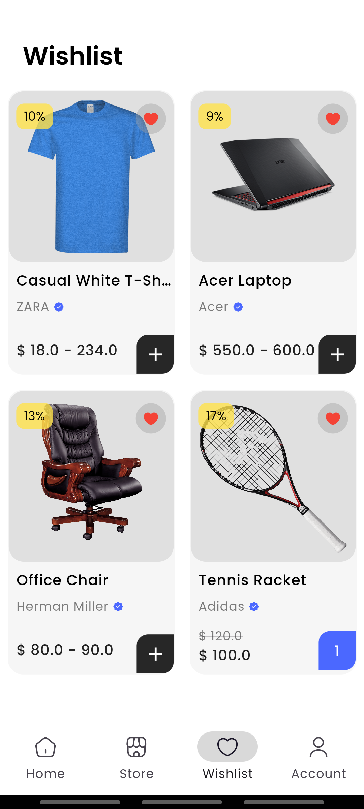

# E-Commerce Flutter Application

## Introduction
This project is a fully functional e-commerce application built using Flutter. It allows users to browse products, add items to the cart, and proceed to checkout. The app integrates with Firebase for user authentication, real-time database, and storage. It also supports multiple authentication methods like Google Sign-In and email verification. This app is designed to offer a smooth shopping experience with features such as light/dark mode and network management.

### Problem Solved
The application provides an all-in-one solution for building an e-commerce platform, focusing on ease of use for developers and seamless shopping for users. It simplifies the process of integrating Firebase services and managing both user authentication and product data.

### Why It’s Useful
- Ideal for small to medium businesses looking to quickly set up an online store.
- Includes ready-to-use Firebase authentication.
- Extensible for adding new features like payment gateways or additional user management options and localization.

## Installation

To set up and run the project locally, follow these steps:

1. Clone the repository:
    ```bash
    git clone https://github.com/MuhammadAlaa7/e-commerce/
    ```

2. Install dependencies:
    ```bash
    flutter pub get
    ```

3. Set up Firebase:
   - Create a new Firebase project.
   - Enable Firebase Authentication.
   - Download and add `google-services.json` (for Android) and `GoogleService-Info.plist` (for iOS) in the respective directories.

4. Run the app:
    ```bash
    flutter run
    ```

## Usage

After successfully setting up the project, here’s how you can use it:

- **User Authentication**: Sign up, log in, and verify email through Firebase Authentication. Google Sign-In is also supported.
- **Browsing Products**: View available products in the store with images, descriptions, and prices.
- **Add to Cart**: Select products and add them to your shopping cart.
- **Checkout**: Proceed to the checkout screen to review your order.
- **Dark Mode**: Toggle between light and dark modes from the account screen.

### Screenshots

# Screenshots
# Screenshots

## 1. Onboarding Screens

| Onboarding 1  | Onboarding 2 | Onboarding 3 |
|---------------|--------------|--------------|
|  |  |  |

## 2. Auth Screens

| Login  | Signup | Forgot Password |
|--------|--------|-----------------|
|  |  |  |

## 3. Home and Category

| Home  | Category | Category Products |
|-------|----------|-------------------|
|  |  |  |

## 4. Store Light and Dark and All Brands

| Store (Light)  | Store (Dark) | All Brands |
|----------------|--------------|------------|
|  |  |  |

## 5. Brand Products and Category Products

| Brand Products  | Brand Products (Dark) | Category Products |
|-----------------|-----------------------|-------------------|
|  |  |  |

## 6. Product Single and Variable (Light and Dark)

| Single Product (Light)  | Single Product (Dark) | Variable Product (Light) |
|-------------------------|-----------------------|--------------------------|
|  |  |  |

## 7. Wishlist, Cart, and Address

| Wishlist  | Cart | Address |
|-----------|------|---------|
|  |  |  |

## 8. Order, Review, and Finish

| Order Review  | Order Review 2 | Finish Order |
|---------------|----------------|--------------|
|  |  |  |


## Contributing

We welcome contributions! Here's how you can help:

1. **Submit Pull Requests**: Feel free to fork the repository, create a branch, and submit pull requests for any enhancements or bug fixes.
2. **Report Bugs**: If you find a bug, please create an issue with detailed information about the problem.
3. **Request Features**: Suggest new features by creating an issue.

### Steps to Contribute:
1. Fork the repository.
2. Create a feature branch:
   ```bash
   git checkout -b feature-name

